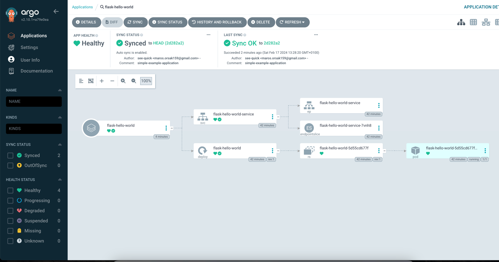

## Introduction

ArgoCD automates the deployment of desired application states stored in Git repositories to Kubernetes clusters, 
embracing the GitOps principles. 
This guide illustrates a practical approach to deploying applications using ArgoCD with Minikube as the Kubernetes environment.

## Prerequisites
- A Kubernetes cluster via Minikube or kind.
- Familiarity with Kubernetes fundamentals.
- ArgoCD CLI installed on your machine.

## Setting Up Your Kubernetes Environment

Minikube:
1. Install Minikube following the instructions on the official [Minikube GitHub page](https://github.com/kubernetes/minikube).
2. Start your cluster:
```bash
minikube start # also if needed configure more cpus and memory if you need more f.e. --cpus=8 --memory=8192
````
Make sure that your minikube cluster is running via command:
```bash
minikube status
```
and the output should be similar to this one:
```bash
minikube
type: Control Plane
host: Running
kubelet: Running
apiserver: Running
kubeconfig: Configured
```

## Installing ArgoCD
Apply the ArgoCD installation YAML from the official repo: 
```bash
kubectl create namespace argocd
kubectl apply -n argocd -f https://raw.githubusercontent.com/argoproj/argo-cd/v2.10.1/manifests/install.yaml
```

Ensure ArgoCD services are running: 
```bash
kubectl get pods -n argocd
```
after some time you should see:
```bash
argocd-application-controller-0                     1/1     Running   0          72s
argocd-applicationset-controller-5b8f7d5948-nsr7j   1/1     Running   0          73s
argocd-dex-server-8496698f-rpj48                    1/1     Running   0          73s
argocd-notifications-controller-8b78cbcf8-qxxll     1/1     Running   0          73s
argocd-redis-8484cb8cc4-wf66x                       1/1     Running   0          73s
argocd-repo-server-5bdc99b44f-k29cp                 1/1     Running   0          73s
argocd-server-6c78c864b-qlrnt                       1/1     Running   0          73s
```

## Configuring ArgoCD
Access the ArgoCD UI through port-forwarding: kubectl port-forward svc/argocd-server -n argocd 8080:443. 
Then, navigate to localhost:8080 in your browser.

### Creating a Sample Application

Create a simple Hello World application and define your Kubernetes deployment and service manifests. 
Push these manifests to a Git repository.

Let's create a simple "Hello World" web application that we can deploy using ArgoCD on a Kubernetes cluster. 
This example will include a basic Python Flask application and the Kubernetes manifests required for deployment.

**Step 1:** Create the Flask Application
```python
from flask import Flask
app = Flask(__name__)

@app.route('/')
def hello_world():
    return 'Hello, World from Flask!'

if __name__ == '__main__':
    app.run(host='0.0.0.0', port=8080)
```

**Step 2:** Dockerize the Application

```dockerfile
# Use an official Python runtime as a parent image
FROM python:3.8-slim

# Set the working directory in the container
WORKDIR /app

# Copy the current directory contents into the container at /app
COPY app.py /app

# Install any needed packages specified in requirements.txt
RUN pip install --trusted-host pypi.python.org Flask

# Make port 8080 available to the world outside this container
EXPOSE 8080

# Define environment variable
ENV NAME World

# Run app.py when the container launches
CMD ["python", "app.py"]
```
also make sure that you have created file requirements.txt with the following content:
```bash
Flask
```

**Step 3:** Kubernetes Deployment and Service Manifest

```yaml
apiVersion: apps/v1
kind: Deployment
metadata:
  name: flask-hello-world
spec:
  replicas: 1
  selector:
    matchLabels:
      app: flask-hello-world
  template:
    metadata:
      labels:
        app: flask-hello-world
    spec:
      containers:
        - name: flask-hello-world
          image: hello-world-from-flask:latest # <-- replace with your image
          imagePullPolicy: IfNotPresent  # By default, Kubernetes will always 
          # try to pull an image with the tag latest. By specifying an image 
          # pull policy of IfNotPresent, Kubernetes will only pull the image 
          # if it doesn't already exist locally.
          ports:
            - containerPort: 8080
```

```yaml
apiVersion: v1
kind: Service
metadata:
  name: flask-hello-world-service
spec:
  type: NodePort
  ports:
    - port: 8080
      targetPort: 8080
      protocol: TCP
      nodePort: 30007 # Optional: Specify a nodePort in the
      #  range (30000-32767) if you want a specific port
  selector:
    app: flask-hello-world
```

Now you need to do the following steps:
1. Build the docker image, based on your pre-defined Dockerfile
2. You could use either Docker daemon (i.e., `eval $(minikube docker-env)`) 
this would point your terminal to use the docker daemon inside minikube
3. Or you could use a minikube registry, but using docker daemon is more simple so we would stick with that.

### Building and testing application inside Minikube

This guide assumes that you have Minikube and [kubectl](https://kubernetes.io/docs/tasks/tools/) installed on your machine.
We’ll go through the steps to build a Docker image for a simple Flask application and deploy it to Minikube.

#### Step 1: Point to Minikube's Docker Daemon

First, ensure that your terminal is using the Docker daemon inside Minikube:
```bash
eval $(minikube docker-env)
```

#### Step 2: Build Your Docker Image

Navigate to the directory containing your Flask app and Dockerfile, then build your Docker image:

```bash
docker build -t hello-world-from-flask:latest .
```

#### Step 3: Verify the Image Is in Minikube

Check that your Docker image is now available in Minikube's local image registry:

```bash
minikube image list
```

Look for `docker.io/library/hello-world-from-flask:latest` in the output. 
For instance it should look like this:
```bash
minikube image list
registry.k8s.io/pause:3.9
registry.k8s.io/kube-scheduler:v1.26.3
registry.k8s.io/kube-proxy:v1.26.3
registry.k8s.io/kube-controller-manager:v1.26.3
registry.k8s.io/kube-apiserver:v1.26.3
registry.k8s.io/etcd:3.5.6-0
registry.k8s.io/coredns/coredns:v1.9.3
gcr.io/k8s-minikube/storage-provisioner:v5
docker.io/library/hello-world-from-flask:latest <-- here is your builded image
```

#### Step 4: Deploy Your Application to Kubernetes

Apply your Kubernetes manifests to create the deployment and service:

```bash
kubectl apply -f kubernetes/ -n default
```

#### Step 5: Check Your Deployment

Ensure that your pod is up and running:

```bash
kubectl get pod -n default
```

#### Step 6: View Logs to Confirm Your Application Is Running

Check the application logs to make sure your Flask app is running without errors:

```bash
kubectl logs -f <your-pod-name>
```
For instance: 
```bash
kubectl logs -f flask-hello-world-5d55cd677f-rcsg6
* Serving Flask app 'app'
* Debug mode: off
* Running on all addresses (0.0.0.0)
* Running on http://127.0.0.1:8080
* Running on http://10.244.0.8:8080
  Press CTRL+C to quit
  10.244.0.1 - - [17/Feb/2024 11:51:44] "GET / HTTP/1.1" 200 -
```

Replace `<your-pod-name>` with the actual name of your pod.

#### Step 7: Access Your Flask Application

Use Minikube to determine the URL to access your Flask application:

```bash
minikube service flask-hello-world-service --url
```

The command will output an accessible URL. 
If you're on macOS and using Docker as the driver, keep the terminal open to access the service. 
You will see something like this:


You should now have a clear understanding of how to deploy and access a Flask application on Minikube. 
Follow these steps, and you'll have your application running in a local Kubernetes environment in no time.

### Deploying with ArgoCD

Make sure you have installed [argocd CLI](https://github.com/argoproj/argo-cd/blob/master/docs/getting_started.md#:~:text=CLI%20installation%20documentation).
Link ArgoCD to your Git repository containing the Kubernetes manifests:
1. **Via UI**: Use the ArgoCD dashboard to connect your repository and define the deployment.
```bash
# 1. port forward
kubectl port-forward svc/argocd-server -n argocd 8080:443 
# 2. navigate to localhost:8080

# 3. you need to find out what is the default username and password
# - default username is admin
# - default password is pre-generated and you can simply retrieve it via argocd CLI
argocd admin initial-password -n argocd
# 3. then you can login into UI
```
2. **Via CLI**: argocd app create --repo <your_repo_url> --path <manifests_location> --dest-server https://kubernetes.default.svc --dest-namespace default.
3. **Pre-defined YAML**: Apply Custom Resource of ArgoCD for instance
```yaml
apiVersion: argoproj.io/v1alpha1
kind: Application
metadata:
  name: flask-hello-world
  namespace: argocd
spec:
  project: default
  source:
    repoURL: 'https://github.com/see-quick/simple-project' # replace this with your own simple project...
    path: 'kubernetes' # this would be a directory where you have your Kubernetes files of your application, and you want them in sync
    targetRevision: HEAD
  destination:
    server: 'https://kubernetes.default.svc'
    namespace: default
  syncPolicy:
    automated:
      selfHeal: true
      prune: true
```
and then after you apply this you could see that a new application inside ArgoCD UI:

and when you click on that application you would see whole topology (i.e., Deployment, Service)


## Update of the application

To update the version of the Docker image your application uses, you need to follow these steps:

### Step 1: Update Your Application
Make the necessary updates to your Flask application. 
If there are no changes to the application code and you just want to update the image tag, 
you can skip to the next step.
But for clarity, we can update source code:
```python
from flask import Flask
app = Flask(__name__)

@app.route('/')
def hello_world():
    return 'Hello, World from Flask! Second version!'

if __name__ == '__main__':
    app.run(host='0.0.0.0', port=8080)
```

### Step 2: Rebuild and Tag Your Docker Image

Make sure you are still using Minikube's Docker daemon:
```bash
eval $(minikube docker-env)
```
and then build your updated Docker image with a new tag (other than latest to ensure Kubernetes recognizes the update).
```bash
docker build -t hello-world-from-flask:v2 .
```
Now you should see your image and you can check it via 
```bash
minikube image list
```
For instance in my case:
```bash
registry.k8s.io/pause:3.9
registry.k8s.io/kube-scheduler:v1.26.3
registry.k8s.io/kube-proxy:v1.26.3
registry.k8s.io/kube-controller-manager:v1.26.3
registry.k8s.io/kube-apiserver:v1.26.3
registry.k8s.io/etcd:3.5.6-0
registry.k8s.io/coredns/coredns:v1.9.3
quay.io/argoproj/argocd:v2.10.1
ghcr.io/dexidp/dex:v2.37.0
gcr.io/k8s-minikube/storage-provisioner:v5
docker.io/library/redis:7.0.14-alpine
docker.io/library/hello-world-from-flask:v2 # <-- a new image 
docker.io/library/hello-world-from-flask:latest
```

### Step 3: Update Your Kubernetes Manifest

```yaml
apiVersion: apps/v1
kind: Deployment
metadata:
  name: flask-hello-world
spec:
  ...
  template:
    ...
    spec:
      containers:
      - name: flask-hello-world 
        image: hello-world-from-flask:v2 # <-- change tag
        ...
```

### Step 4: Commit and Push the changes of your git repository

It should be two changes and for correction:
```bash
❯ git status
On branch main
Your branch is up to date with 'origin/main'.

Changes not staged for commit:
  (use "git add <file>..." to update what will be committed)
  (use "git restore <file>..." to discard changes in working directory)
        modified:   app.py
        modified:   kubernetes/deployment.yaml
❯ git add .
❯ git commit -s -m 'Update version 2 of the application' 
❯ git push origin main
```
With this push the ArgoCD should react with syncing to the new version of application. 
That's because we have defined in our ArgoCD Application Custom Resource the 
```yaml
syncPolicy:
    automated: # <--- When you push the updated deployment.yaml with the new image tag to your Git repository, 
    # ArgoCD will automatically initiate a sync, applying the changes to your cluster.
      selfHeal: true # If there are any discrepancies between your desired state in Git and the actual state in your cluster, 
      # ArgoCD will automatically correct them.
      prune: true #  If you remove resources from your Git repository, ArgoCD will automatically delete these from your cluster as well.
```

### Step 5: Monitor the ArgoCD Automated Sync Process

After you've updated your Kubernetes manifest and pushed the changes to your Git repository, 
ArgoCD will automatically detect these changes and initiate a sync, 
thanks to the automated sync policy you've configured. 
This process is driven by ArgoCD's reconciliation loop, which by default runs every 3 minutes. 
Here's how you can monitor and verify that the automated sync has taken place:

#### Before the Push
Before you push your changes to the Git repository, you can view the current state of your application in the ArgoCD dashboard. 


This provides a baseline against which you can compare post-update changes. 
The application's status should indicate that it's synced and healthy, reflecting the state before the update.


#### Pushing Changes

Once you push the updated deployment.yaml file with the new image version to your repository, 
ArgoCD will begin its automated sync process based on the reconciliation interval.

#### After the Push

Approximately 3 minutes after your push (considering the default reconciliation interval), 
you can observe the changes reflected in the ArgoCD dashboard. 


The application view will update to show the new image version being deployed, 
along with any other changes you've made. 
This visual confirmation is a powerful feature of ArgoCD, providing immediate feedback on the deployment status of your application.


## Conclusion
The automated sync feature of ArgoCD, complemented by its self-healing capabilities, 
ensures that your applications in Kubernetes are always in sync with the desired 
state defined in your Git repository. By leveraging ArgoCD, you can achieve a more 
streamlined and reliable deployment process, reducing manual intervention and potential human errors. 
Keep an eye on the ArgoCD dashboard for real-time updates and utilize the CLI for in-depth application insights and troubleshooting.

