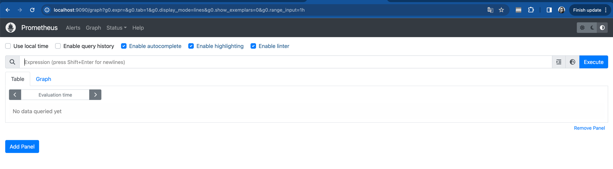
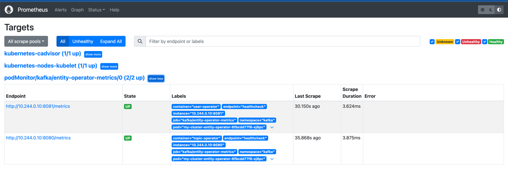
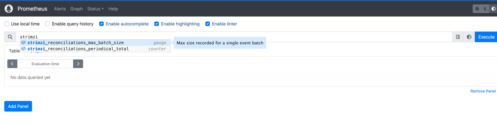
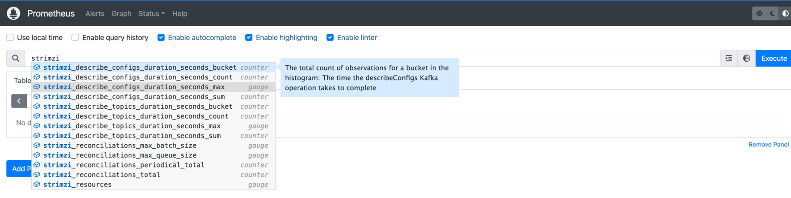
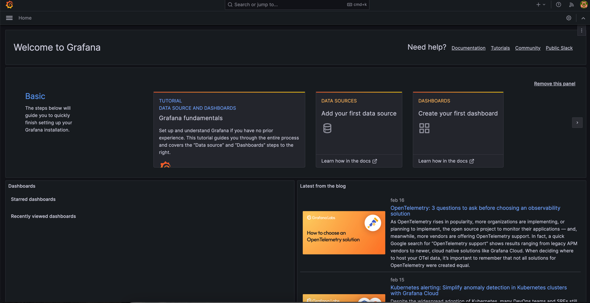
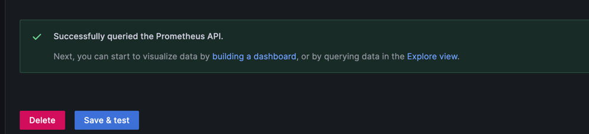

## Why Monitor Your Application?

In today's fast-paced technology landscape, ensuring the reliability, availability, and performance of your applications 
is paramount. 
Monitoring your application is not just a luxury; it's a necessity. 
It allows you to understand the health of your application, diagnose issues before they impact users, and optimize resources for efficiency. 
With the complexity of modern applications, especially those running in distributed environments, 
having a robust monitoring strategy in place is essential to maintain a seamless user experience.

## What to Monitor: The Case of Topic Operator in the Strimzi Project

Strimzi simplifies the process of running Apache Kafka in a Kubernetes cluster. 
A key component of Strimzi is the Topic Operator, which manages Kafka topics within a Kubernetes cluster. 
Monitoring the Topic Operator is critical as it handles the creation, deletion, and configuration of Kafka topics, directly 
impacting the messaging flow of applications relying on Kafka.

Key metrics to monitor in the **Topic Operator** include:

- **Topic Creation, Modification, and Deletion Rates:** These metrics help understand the workload handled by the Operator and identify any anomalies in topic management.
- **Operator Response Times:** Monitoring how quickly the Operator responds to requests can help identify performance bottlenecks.
- **Resource Utilization:** CPU, memory, and network metrics of the Topic Operator pod can indicate the health and efficiency of the Operator.
- **Error Rates:** Tracking errors and failed operations can help quickly pinpoint issues in the topic management process.

### Deploying Strimzi with Topic Operator

The steps for deploying Strimzi with Topic Operator are as follows:
1. Prepare Your Kubernetes Cluster 
   1. Ensure your Kubernetes cluster is up and running.
   2. Have **kubectl** installed and configured to communicate with your cluster.
3. Create an `kafka` namespace
```bash
kubectl create ns kafka 
```
4. Install the Strimzi Custom Resource Definitions (CRDs) and **Cluster Operator** in kafka namespace:
```bash
kubectl create -f https://strimzi.io/install/latest?namespace=kafka -n kafka 
```
5. Create a Kafka Cluster 
6. In Strimzi, Topic Operator is tight to Kafka Custom Resource (CR) and so if one wants to deploy Topic Operator
one has to deploy Kafka cluster with Topic Operator enabled. Here is the YAML defining such deployment:

```yaml
apiVersion: kafka.strimzi.io/v1beta2
kind: Kafka
metadata:
  name: my-cluster
spec:
  kafka:
    version: 3.6.1
    replicas: 3
    listeners:
      - name: plain
        port: 9092
        type: internal
        tls: false
      - name: tls
        port: 9093
        type: internal
        tls: true
    config:
      offsets.topic.replication.factor: 3
      transaction.state.log.replication.factor: 3
      transaction.state.log.min.isr: 2
      default.replication.factor: 3
      min.insync.replicas: 2
      inter.broker.protocol.version: "3.6"
    storage:
      type: jbod
      volumes:
      - id: 0
        type: persistent-claim
        size: 100Gi
        deleteClaim: false
    metricsConfig:
      type: jmxPrometheusExporter
      valueFrom:
        configMapKeyRef:
          name: kafka-metrics
          key: kafka-metrics-config.yml
  zookeeper:
    replicas: 3
    storage:
      type: persistent-claim
      size: 100Gi
      deleteClaim: false
    metricsConfig:
      type: jmxPrometheusExporter
      valueFrom:
        configMapKeyRef:
          name: kafka-metrics
          key: zookeeper-metrics-config.yml
  entityOperator:
    topicOperator: {}
    userOperator: {}
  kafkaExporter:
    topicRegex: ".*"
    groupRegex: ".*"
---
kind: ConfigMap
apiVersion: v1
metadata:
  name: kafka-metrics
  labels:
    app: strimzi
data:
  kafka-metrics-config.yml: |
    # See https://github.com/prometheus/jmx_exporter for more info about JMX Prometheus Exporter metrics
    lowercaseOutputName: true
    rules:
    # Special cases and very specific rules
    - pattern: kafka.server<type=(.+), name=(.+), clientId=(.+), topic=(.+), partition=(.*)><>Value
      name: kafka_server_$1_$2
      type: GAUGE
      labels:
        clientId: "$3"
        topic: "$4"
        partition: "$5"
    - pattern: kafka.server<type=(.+), name=(.+), clientId=(.+), brokerHost=(.+), brokerPort=(.+)><>Value
      name: kafka_server_$1_$2
      type: GAUGE
      labels:
        clientId: "$3"
        broker: "$4:$5"
    - pattern: kafka.server<type=(.+), cipher=(.+), protocol=(.+), listener=(.+), networkProcessor=(.+)><>connections
      name: kafka_server_$1_connections_tls_info
      type: GAUGE
      labels:
        cipher: "$2"
        protocol: "$3"
        listener: "$4"
        networkProcessor: "$5"
    - pattern: kafka.server<type=(.+), clientSoftwareName=(.+), clientSoftwareVersion=(.+), listener=(.+), networkProcessor=(.+)><>connections
      name: kafka_server_$1_connections_software
      type: GAUGE
      labels:
        clientSoftwareName: "$2"
        clientSoftwareVersion: "$3"
        listener: "$4"
        networkProcessor: "$5"
    - pattern: "kafka.server<type=(.+), listener=(.+), networkProcessor=(.+)><>(.+):"
      name: kafka_server_$1_$4
      type: GAUGE
      labels:
        listener: "$2"
        networkProcessor: "$3"
    - pattern: kafka.server<type=(.+), listener=(.+), networkProcessor=(.+)><>(.+)
      name: kafka_server_$1_$4
      type: GAUGE
      labels:
        listener: "$2"
        networkProcessor: "$3"
    # Some percent metrics use MeanRate attribute
    # Ex) kafka.server<type=(KafkaRequestHandlerPool), name=(RequestHandlerAvgIdlePercent)><>MeanRate
    - pattern: kafka.(\w+)<type=(.+), name=(.+)Percent\w*><>MeanRate
      name: kafka_$1_$2_$3_percent
      type: GAUGE
    # Generic gauges for percents
    - pattern: kafka.(\w+)<type=(.+), name=(.+)Percent\w*><>Value
      name: kafka_$1_$2_$3_percent
      type: GAUGE
    - pattern: kafka.(\w+)<type=(.+), name=(.+)Percent\w*, (.+)=(.+)><>Value
      name: kafka_$1_$2_$3_percent
      type: GAUGE
      labels:
        "$4": "$5"
    # Generic per-second counters with 0-2 key/value pairs
    - pattern: kafka.(\w+)<type=(.+), name=(.+)PerSec\w*, (.+)=(.+), (.+)=(.+)><>Count
      name: kafka_$1_$2_$3_total
      type: COUNTER
      labels:
        "$4": "$5"
        "$6": "$7"
    - pattern: kafka.(\w+)<type=(.+), name=(.+)PerSec\w*, (.+)=(.+)><>Count
      name: kafka_$1_$2_$3_total
      type: COUNTER
      labels:
        "$4": "$5"
    - pattern: kafka.(\w+)<type=(.+), name=(.+)PerSec\w*><>Count
      name: kafka_$1_$2_$3_total
      type: COUNTER
    # Generic gauges with 0-2 key/value pairs
    - pattern: kafka.(\w+)<type=(.+), name=(.+), (.+)=(.+), (.+)=(.+)><>Value
      name: kafka_$1_$2_$3
      type: GAUGE
      labels:
        "$4": "$5"
        "$6": "$7"
    - pattern: kafka.(\w+)<type=(.+), name=(.+), (.+)=(.+)><>Value
      name: kafka_$1_$2_$3
      type: GAUGE
      labels:
        "$4": "$5"
    - pattern: kafka.(\w+)<type=(.+), name=(.+)><>Value
      name: kafka_$1_$2_$3
      type: GAUGE
    # Emulate Prometheus 'Summary' metrics for the exported 'Histogram's.
    # Note that these are missing the '_sum' metric!
    - pattern: kafka.(\w+)<type=(.+), name=(.+), (.+)=(.+), (.+)=(.+)><>Count
      name: kafka_$1_$2_$3_count
      type: COUNTER
      labels:
        "$4": "$5"
        "$6": "$7"
    - pattern: kafka.(\w+)<type=(.+), name=(.+), (.+)=(.*), (.+)=(.+)><>(\d+)thPercentile
      name: kafka_$1_$2_$3
      type: GAUGE
      labels:
        "$4": "$5"
        "$6": "$7"
        quantile: "0.$8"
    - pattern: kafka.(\w+)<type=(.+), name=(.+), (.+)=(.+)><>Count
      name: kafka_$1_$2_$3_count
      type: COUNTER
      labels:
        "$4": "$5"
    - pattern: kafka.(\w+)<type=(.+), name=(.+), (.+)=(.*)><>(\d+)thPercentile
      name: kafka_$1_$2_$3
      type: GAUGE
      labels:
        "$4": "$5"
        quantile: "0.$6"
    - pattern: kafka.(\w+)<type=(.+), name=(.+)><>Count
      name: kafka_$1_$2_$3_count
      type: COUNTER
    - pattern: kafka.(\w+)<type=(.+), name=(.+)><>(\d+)thPercentile
      name: kafka_$1_$2_$3
      type: GAUGE
      labels:
        quantile: "0.$4"
    # KRaft mode: uncomment the following lines to export KRaft related metrics
    # KRaft overall related metrics
    # distinguish between always increasing COUNTER (total and max) and variable GAUGE (all others) metrics
    #- pattern: "kafka.server<type=raft-metrics><>(.+-total|.+-max):"
    #  name: kafka_server_raftmetrics_$1
    #  type: COUNTER
    #- pattern: "kafka.server<type=raft-metrics><>(.+):"
    #  name: kafka_server_raftmetrics_$1
    #  type: GAUGE
    # KRaft "low level" channels related metrics
    # distinguish between always increasing COUNTER (total and max) and variable GAUGE (all others) metrics
    #- pattern: "kafka.server<type=raft-channel-metrics><>(.+-total|.+-max):"
    #  name: kafka_server_raftchannelmetrics_$1
    #  type: COUNTER
    #- pattern: "kafka.server<type=raft-channel-metrics><>(.+):"
    #  name: kafka_server_raftchannelmetrics_$1
    #  type: GAUGE
    # Broker metrics related to fetching metadata topic records in KRaft mode
    #- pattern: "kafka.server<type=broker-metadata-metrics><>(.+):"
    #  name: kafka_server_brokermetadatametrics_$1
    #  type: GAUGE
  zookeeper-metrics-config.yml: |
    # See https://github.com/prometheus/jmx_exporter for more info about JMX Prometheus Exporter metrics
    lowercaseOutputName: true
    rules:
    # replicated Zookeeper
    - pattern: "org.apache.ZooKeeperService<name0=ReplicatedServer_id(\\d+)><>(\\w+)"
      name: "zookeeper_$2"
      type: GAUGE
    - pattern: "org.apache.ZooKeeperService<name0=ReplicatedServer_id(\\d+), name1=replica.(\\d+)><>(\\w+)"
      name: "zookeeper_$3"
      type: GAUGE
      labels:
        replicaId: "$2"
    - pattern: "org.apache.ZooKeeperService<name0=ReplicatedServer_id(\\d+), name1=replica.(\\d+), name2=(\\w+)><>(Packets\\w+)"
      name: "zookeeper_$4"
      type: COUNTER
      labels:
        replicaId: "$2"
        memberType: "$3"
    - pattern: "org.apache.ZooKeeperService<name0=ReplicatedServer_id(\\d+), name1=replica.(\\d+), name2=(\\w+)><>(\\w+)"
      name: "zookeeper_$4"
      type: GAUGE
      labels:
        replicaId: "$2"
        memberType: "$3"
    - pattern: "org.apache.ZooKeeperService<name0=ReplicatedServer_id(\\d+), name1=replica.(\\d+), name2=(\\w+), name3=(\\w+)><>(\\w+)"
      name: "zookeeper_$4_$5"
      type: GAUGE
      labels:
        replicaId: "$2"
        memberType: "$3"
```


Make sure that you have the right Kafka version configured.

6. Apply such configuration to deploy Kafka cluster with Topic Operator
```bash
kubectl apply -f kafka-cluster.yaml -n kafka
```
7. Check that pods are in running state.
```bash
kubectl get pod -n kafka
NAME                                          READY   STATUS    RESTARTS   AGE
my-cluster-entity-operator-6fbcdd77f6-xj8pc   2/2     Running   0          18m
my-cluster-kafka-0                            1/1     Running   0          19m
my-cluster-kafka-1                            1/1     Running   0          19m
my-cluster-kafka-2                            1/1     Running   0          19m
my-cluster-kafka-exporter-896bfd5b4-z2284     1/1     Running   0          17m
my-cluster-zookeeper-0                        1/1     Running   0          20m
my-cluster-zookeeper-1                        1/1     Running   0          20m
my-cluster-zookeeper-2                        1/1     Running   0          20m
strimzi-cluster-operator-75d7f76545-4hckh     1/1     Running   0          22m
```
One can see that there is an `entity-operator` and Strimzi has two operators inside (i.e., User Operator and Topic Operator).
If we check such Pod, we would see in `Containers:` section topic-operator and user-operator.
```bash
oc describe pod my-cluster-entity-operator-6fbcdd77f6-xj8pc -n kafka
```
The mention of deploying a Kafka cluster "with metrics enabled" refers to the configuration that exposes various metrics 
from Kafka brokers, the Topic Operator, and the User Operator. 
These metrics provide insights into the performance, health, and behavior of your Kafka cluster and its operators.

Enabling metrics involves configuring your Kafka cluster (via the Strimzi Kafka CR) to expose metrics endpoints that 
Prometheus can scrape. 
This is typically done by adding Prometheus annotations to the Kafka pods and setting up proper metrics reporters 
within the Kafka configuration.
8. Directly Checking Topic Operator Metrics
```bash
kubectl exec my-cluster-entity-operator-6fbcdd77f6-xj8pc -n kafka -it -- curl localhost:8080/metrics
```
One could see very similar output like this:
```bash
kubectl exec my-cluster-entity-operator-6fbcdd77f6-xj8pc -n kafka -it -- curl localhost:8080/metrics
Defaulted container "topic-operator" out of: topic-operator, user-operator
... # other metrics ignored for brevity
...
jvm_buffer_memory_used_bytes{id="mapped",} 0.0
jvm_buffer_memory_used_bytes{id="direct",} 183162.0
# HELP strimzi_reconciliations_max_batch_size Max size recorded for a single event batch
# TYPE strimzi_reconciliations_max_batch_size gauge
strimzi_reconciliations_max_batch_size{kind="KafkaTopic",namespace="kafka",selector="strimzi.io/cluster=my-cluster",} 0.0
```

With metrics working on Topic Operator side, we could move on to setting up Prometheus and Grafana.

## How to Monitor Using Grafana and Prometheus

### Setting Up Prometheus
Prometheus, an open-source monitoring solution, collects and stores metrics as time series data. 
It's an ideal choice for monitoring Kubernetes applications like the Topic Operator. 
To set up Prometheus:
1. **Install Prometheus Operator:** 
```bash
LATEST=$(curl -s https://api.github.com/repos/prometheus-operator/prometheus-operator/releases/latest | jq -cr .tag_name)
curl -sL https://github.com/prometheus-operator/prometheus-operator/releases/download/$LATEST/bundle.yaml | sed -e 's/namespace: default/namespace: kafka/' | kubectl create -f -
```
2. We need to install **Prometheus instance** (simply apply all these files):

```yaml
apiVersion: rbac.authorization.k8s.io/v1
kind: ClusterRole
metadata:
  name: prometheus-server
  labels:
    app: strimzi
rules:
  - apiGroups: [""]
    resources:
      - nodes
      - nodes/proxy
      - services
      - endpoints
      - pods
    verbs: ["get", "list", "watch"]
  - apiGroups:
      - extensions
    resources:
      - ingresses
    verbs: ["get", "list", "watch"]
  - nonResourceURLs: ["/metrics"]
    verbs: ["get"]

---
apiVersion: v1
kind: ServiceAccount
metadata:
  name: prometheus-server
  labels:
    app: strimzi

---
apiVersion: rbac.authorization.k8s.io/v1
kind: ClusterRoleBinding
metadata:
  name: prometheus-server
  labels:
    app: strimzi
roleRef:
  apiGroup: rbac.authorization.k8s.io
  kind: ClusterRole
  name: prometheus-server
subjects:
  - kind: ServiceAccount
    name: prometheus-server
    namespace: kafka

---
apiVersion: monitoring.coreos.com/v1
kind: Prometheus
metadata:
  name: prometheus
  labels:
    app: strimzi
spec:
  replicas: 1
  serviceAccountName: prometheus-server
  podMonitorSelector:
    matchLabels:
      app: strimzi
  serviceMonitorSelector: {}
  resources:
    requests:
      memory: 400Mi
  enableAdminAPI: false
  ruleSelector:
    matchLabels:
      role: alert-rules
      app: strimzi
  additionalScrapeConfigs:
    name: additional-scrape-configs
    key: prometheus-additional.yaml
```

and there is also `prometheus-additional.yaml`, which looks like this.

```yaml
apiVersion: v1
kind: Secret
metadata:
  name: additional-scrape-configs
type: Opaque
stringData:
  prometheus-additional.yaml: |
    - job_name: kubernetes-cadvisor
      honor_labels: true
      scrape_interval: 10s
      scrape_timeout: 10s
      metrics_path: /metrics/cadvisor
      scheme: https
      kubernetes_sd_configs:
      - role: node
        namespaces:
          names: []
      bearer_token_file: /var/run/secrets/kubernetes.io/serviceaccount/token
      tls_config:
        ca_file: /var/run/secrets/kubernetes.io/serviceaccount/ca.crt
        insecure_skip_verify: true
      relabel_configs:
      - separator: ;
        regex: __meta_kubernetes_node_label_(.+)
        replacement: $1
        action: labelmap
      - separator: ;
        regex: (.*)
        target_label: __address__
        replacement: kubernetes.default.svc:443
        action: replace
      - source_labels: [__meta_kubernetes_node_name]
        separator: ;
        regex: (.+)
        target_label: __metrics_path__
        replacement: /api/v1/nodes/${1}/proxy/metrics/cadvisor
        action: replace
      - source_labels: [__meta_kubernetes_node_name]
        separator: ;
        regex: (.*)
        target_label: node_name
        replacement: $1
        action: replace
      - source_labels: [__meta_kubernetes_node_address_InternalIP]
        separator: ;
        regex: (.*)
        target_label: node_ip
        replacement: $1
        action: replace
      metric_relabel_configs:
      - source_labels: [container, __name__]
        separator: ;
        regex: POD;container_(network).*
        target_label: container
        replacement: $1
        action: replace
      - source_labels: [container]
        separator: ;
        regex: POD
        replacement: $1
        action: drop
      - source_labels: [container]
        separator: ;
        regex: ^$
        replacement: $1
        action: drop
      - source_labels: [__name__]
        separator: ;
        regex: container_(network_tcp_usage_total|tasks_state|memory_failures_total|network_udp_usage_total)
        replacement: $1
        action: drop

    - job_name: kubernetes-nodes-kubelet
      scrape_interval: 10s
      scrape_timeout: 10s
      scheme: https
      kubernetes_sd_configs:
      - role: node
        namespaces:
          names: []
      bearer_token_file: /var/run/secrets/kubernetes.io/serviceaccount/token
      tls_config:
        ca_file: /var/run/secrets/kubernetes.io/serviceaccount/ca.crt
        insecure_skip_verify: true
      relabel_configs:
      - action: labelmap
        regex: __meta_kubernetes_node_label_(.+)
      - target_label: __address__
        replacement: kubernetes.default.svc:443
      - source_labels: [__meta_kubernetes_node_name]
        regex: (.+)
        target_label: __metrics_path__
        replacement: /api/v1/nodes/${1}/proxy/metrics
```
3. **Configure Prometheus to Scrape Metrics** 
   - Create a **ServiceMonitor** or **PodMonitor** resource to specify how Prometheus should discover and scrape metrics from the Topic Operator.
   In this case we will create an **PodMonitor** for entity-operator Pod. 
   - Store this in file and then apply using **kubectl** client.

```yaml
apiVersion: monitoring.coreos.com/v1
kind: PodMonitor
metadata:
  name: entity-operator-metrics
  labels:
    app: strimzi
spec:
  selector:
    matchLabels:
      app.kubernetes.io/name: entity-operator
  namespaceSelector:
    matchNames:
      - kafka # make sure that this matches your namespace where EO is deployed
  podMetricsEndpoints:
  - path: /metrics
    port: 8080
```

4. You should see inside Prometheus logs the following
```bash
oc logs -f prometheus-prometheus-0 -n kafka
...
ts=2024-02-18T13:59:02.745Z caller=kubernetes.go:329 level=info component="discovery manager scrape" discovery=kubernetes config=podMonitor/kafka/entity-operator-metrics/0 msg="Using pod service account via in-cluster config"
...
```
This means that Prometheus, discover your PodMonitor for entity operator instance.
5. Make a port forward to check if Prometheus instance is working. 
```bash
kubectl port-forward svc/prometheus-operated 9090 -n kafka
```
You should see very similar to this one:

And also you can verify that metrics are correctly send into Prometheus, when you click on
Status -> Targets and then you would see two endpoints (i.e, for topic and user operator):

6. Use the Prometheus Expression Bar and query the specific metrics:
- The Prometheus UI features an expression bar at the top of the web interface. 
- This is where you can input Prometheus Query Language (PromQL) expressions to query the metrics data that Prometheus has collected.
- To verify that metrics from the Topic Operator are being collected, we could try auto-correct feature which Prometheus UI has, 
simply we can write strimzi as prefix of all metrics reported by Strimzi:

7. There are only two metrics available in standard view. 
To access a more comprehensive range of metrics, an additional configuration is required. 
This can be achieved by setting an environment variable STRIMZI_ENABLE_ADDITIONAL_METRICS to true within the Topic Operator's deployment.
To set this environment variable using kubectl, you would typically update the deployment of the Topic Operator. 
Here's a kubectl command to add or update the environment variable within the Topic Operator's container specification:
Make sure you have download [yq](https://github.com/mikefarah/yq) or one can simply edit Kafka CR using kubectl!
```bash
kubectl get Kafka -n kafka -o yaml > my-cluster-kafka.yaml
yq e '.spec.entityOperator.template.topicOperatorContainer.env = [
  {"name": "STRIMZI_ENABLE_ADDITIONAL_METRICS", "value": "true"},
]' -i my-cluster-kafka.yaml
kubectl apply -f my-cluster-kafka.yaml
```
then one can check topic-operator logs where one can see:
```bash
	maxQueueSize=1024
	maxBatchSize=100
	maxBatchLingerMs=100
	enableAdditionalMetrics=true} ## <--- metrics enabled
2024-02-18 16:05:42,01742 INFO  [main] AppInfoParser:119 - Kafka version: 3.6.1
...
```
8. Now we should create a KafkaTopic Custom Resource to show additional multiple metrics in Prometheus UI.
Currently, there are only two as mentioned above.
Let's try very simple one (apply this using kubectl client):
```yaml
apiVersion: kafka.strimzi.io/v1beta2
kind: KafkaTopic
metadata:
  namespace: kafka
  name: my-topic
  labels:
    strimzi.io/cluster: my-cluster
spec:
  partitions: 1
  replicas: 1
  config:
    retention.ms: 7200000
    segment.bytes: 1073741824
```
Following the execution of the command, all additional metrics should now be visible within the Prometheus UI, 
as illustrated in the image below:


With the necessary Prometheus configurations in place, we can proceed to deploy Grafana and begin the creation of our dashboard.

## Deploying Grafana

In the next phase of our monitoring setup, we will focus on deploying Grafana. Grafana is a powerful visualization tool 
that allows us to create, explore, and share dashboards based on the metrics collected by Prometheus. 
By integrating Grafana with Prometheus, we can build insightful and interactive dashboards that provide 
a comprehensive view of our application's performance and health.

### Steps for Deployment:
1. **Install Grafana:** - Begin by installing Grafana on your cluster. 
Grafana can be deployed in various ways, including Helm charts, Kubernetes manifests, or directly on a VM or a container.
For Kubernetes environments, using Kubernetes manifests such as


```yaml
apiVersion: apps/v1
kind: Deployment
metadata:
   name: grafana
   labels:
      app: strimzi
spec:
   replicas: 1
   selector:
      matchLabels:
         name: grafana
   template:
      metadata:
         labels:
            name: grafana
      spec:
         containers:
            - name: grafana
              image: grafana/grafana:10.3.3
              ports:
                 - name: grafana
                   containerPort: 3000
                   protocol: TCP
              volumeMounts:
                 - name: grafana-data
                   mountPath: /var/lib/grafana
                 - name: grafana-logs
                   mountPath: /var/log/grafana
              readinessProbe:
                 httpGet:
                    path: /api/health
                    port: 3000
                 initialDelaySeconds: 5
                 periodSeconds: 10
              livenessProbe:
                 httpGet:
                    path: /api/health
                    port: 3000
                 initialDelaySeconds: 15
                 periodSeconds: 20
         volumes:
            - name: grafana-data
              emptyDir: {}
            - name: grafana-logs
              emptyDir: {}
---
apiVersion: v1
kind: Service
metadata:
   name: grafana
   labels:
      app: strimzi
spec:
   ports:
      - name: grafana
        port: 3000
        targetPort: 3000
        protocol: TCP
   selector:
      name: grafana
   type: ClusterIP
```


Simply apply these (i.e., kubectl apply -f grafana.yaml -n kafka) and ensure that Grafana is running.
2. **Access Grafana Dashboard** - To access the Grafana dashboard, you may need to set up port forwarding if you're 
running Grafana in a Kubernetes cluster:
```bash
kubectl port-forward svc/grafana 3000:3000 -n kafka
```
After such command is executed you can access Grafana UI in http://localhost:3000. 
You will be prompted to use credentials (default are username:admin password:admin).
3. **Configure Grafana to Use Prometheus as a DataSource** - After Grafana is up and running, configure it to use Prometheus as its data source. 
This can be done within the Grafana UI under the "Data Sources" section, where you will specify your Prometheus server's URL.

then you would click to add Prometheus as datasource after that change **Connection** to
http://prometheus-operated:9090. 
This would ensure that Grafana could communicate with Prometheus instance and scrape all needed metrics.
You then press Save & Test and you should see Success i.e., 


## Conclusion

In conclusion, we have laid a solid foundation for monitoring our Kafka-based application, specifically focusing on the 
Topic Operator component within the Strimzi project.
We have successfully deployed our application, set up a Prometheus instance to collect metrics, and configured Grafana 
for visualizing these metrics. 
The groundwork has been laid for diving into the creation of insightful dashboards, which will be the focus of 
Part II of this guide. 
Stay tuned as we explore how to leverage Grafana's powerful visualization tools to create dashboards that will 
provide comprehensive insights into our application's performance, health, and overall efficiency.
