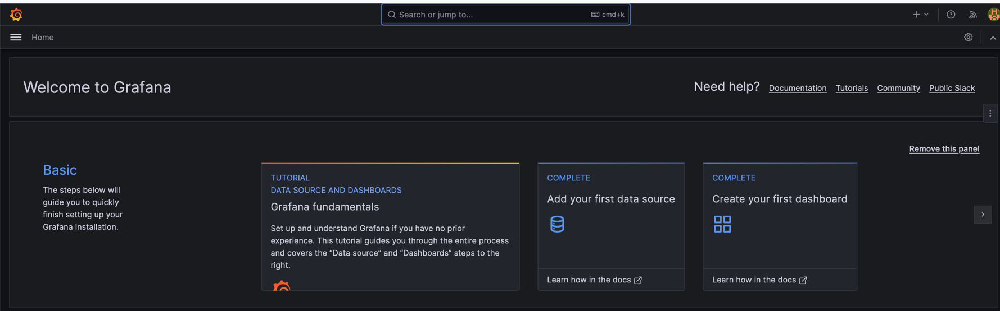
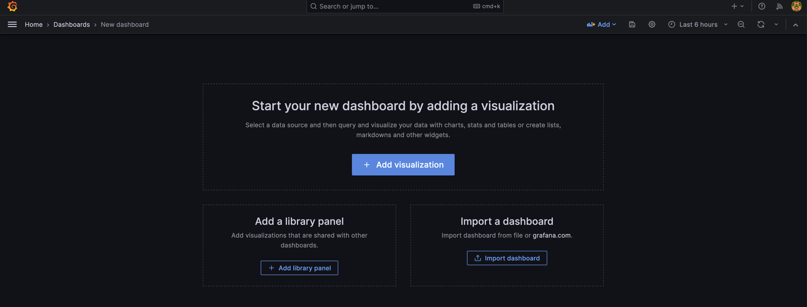
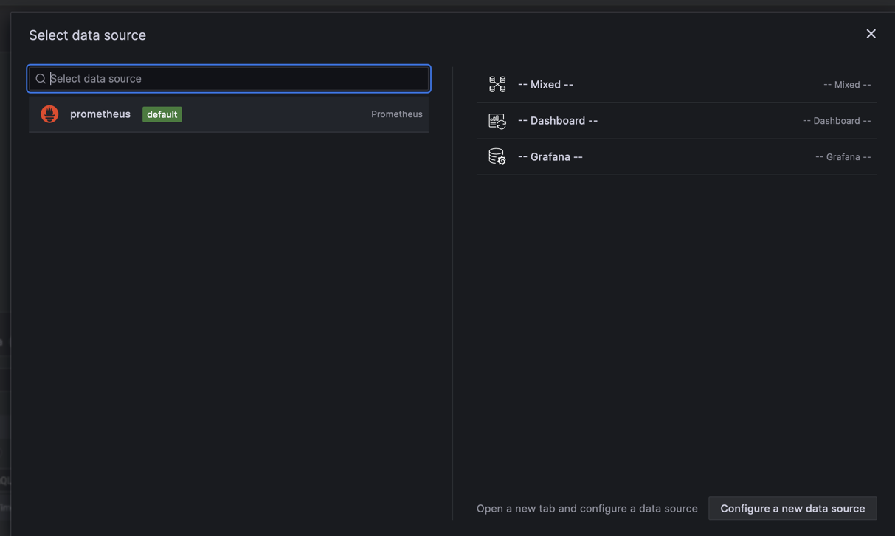
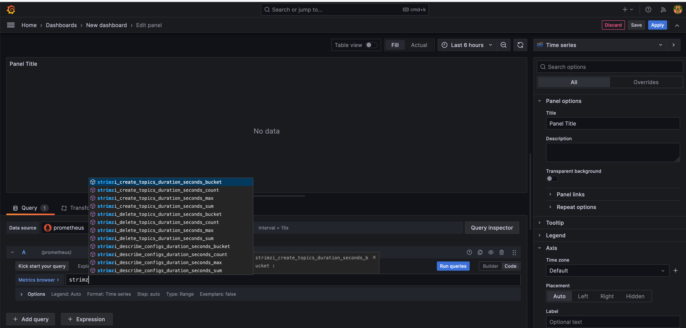
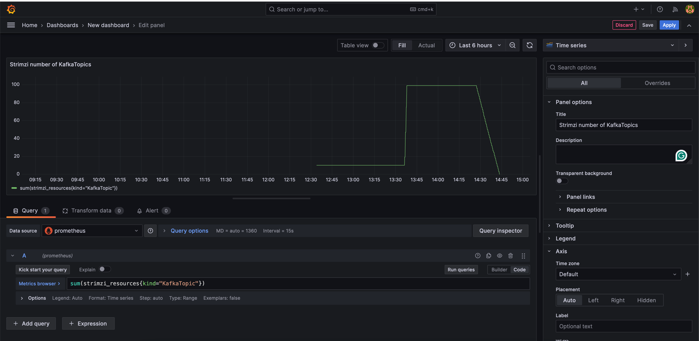
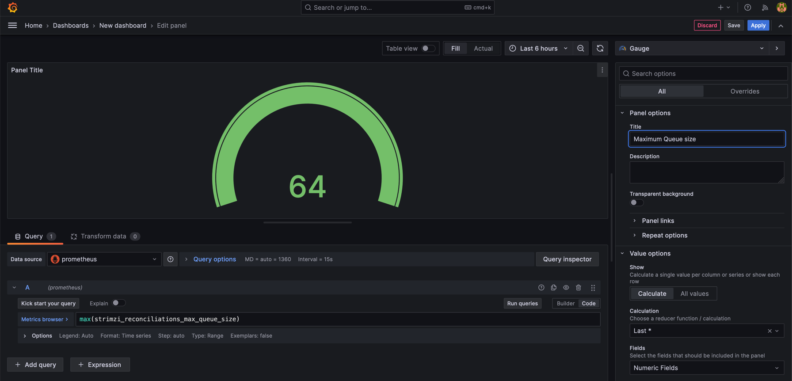
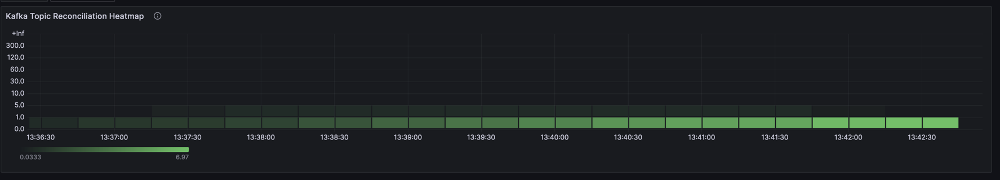
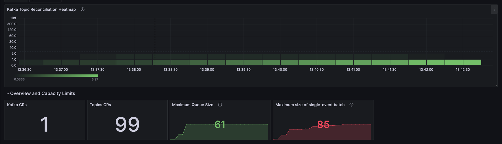
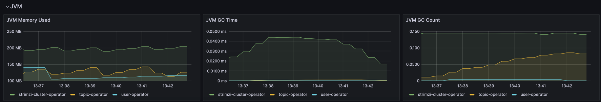

## Introduction

In the first part of this series, we explored the importance of monitoring applications, focusing on setting up Prometheus 
and Grafana for tracking the performance and health of Kafka's Topic Operator within the Strimzi project. 
With the setup complete, Part II will guide you through creating insightful Grafana dashboards. 
These dashboards will help you visualize the metrics collected by Prometheus, providing a comprehensive view of 
your application's performance, health, and overall efficiency.

## Designing Your First Dashboard

A well-designed dashboard is key to effective monitoring. 
It should provide a quick overview of the health and performance of the Topic Operator, 
highlighting any potential issues that require attention.

### Step 1: Access Grafana and Create a New Dashboard
- Log into Grafana.
- Click on "+ Create" and select "Dashboard", or simply got to Create your first dashboard.
- Start by adding a new panel to your dashboard.



### Step 2: Adding Panels

Each panel can display metrics from Prometheus.
As our dashboard is new you would see this 
so click on **Add visualisation** in other words adding a panel.

Note: You would also be probably asked which data source you want to use and as we did this in the previous
blog post use Prometheus. 
If there is no data source you probably did not correctly configure it in Grafana.



Moreover, in the panel you should see all exposed metrics as shown in the picture:


We can create our first panel using **strimzi_resources** metrics, where we also specify kind of the resource i.e., KafkaTopic.



This would show overall number of KafkaTopics for specific time.
I have created 100 of them and then delete them.
A separate panel for Maximum Queue Size helps identify configuration or performance issues by showing queue capacity 
and utilization.



### Why These Dashboards Matter

1. **Operational Insight:** Real-time and historical data analysis enhances operational efficiency and aids in decision-making.
2. **Proactive Monitoring:** Quick identification of issues and trends helps in proactive problem-solving.
3. **Resource Optimization:** Insights into system performance guide effective resource allocation.
4. **Enhanced Collaboration:** Shared dashboards improve team communication and collaborative troubleshooting.

### Step 3: Creating a Complex Heatmap Panel

Heatmaps are excellent for visualizing the distribution of metrics over a range and can provide deep insights into patterns and outliers.

#### How to Create a Heatmap for Topic Reconciliation Times:

1. **Add a New Panel**: Choose the "Heatmap" visualization from the panel type selection.
2. **Configure the Query**: Use a Prometheus query that captures the distribution of reconciliation times, such as:
   ```plaintext
   sum(rate(strimzi_reconciliations_duration_seconds_bucket{kind="KafkaTopic"}[5m])) by (le)
   ```
   This query calculates the rate of the Topic Operator's reconciliation durations over 5 minutes, grouped by latency buckets.
   One may ask why don't we use just pure strimzi_reconciliations_duration_seconds_bucket value instead adding rate function to it.

We use the `rate` function in Prometheus when creating a heatmap for the following reasons:

1. **Time Series Normalization**: `rate` calculates the per-second average rate of increase of the time series in a range vector. This is essential for normalizing the data over time, making it possible to compare changes in behavior over different time periods.
2. **Counter Reset Handling**: Many metrics in Prometheus, like `strimzi_reconciliations_duration_seconds_bucket`, are counters that only increase over time and can reset (e.g., when a process restarts). The `rate` function accounts for these resets, providing an accurate calculation of the rate of events.
3. **Focus on Change**: Heatmaps are often used to visualize changes or the frequency of occurrences over time. The `rate` function highlights the velocity of change rather than the absolute value, which is more meaningful for understanding system behavior and performance trends.
4. **Better Visualization**: Using `rate` provides a clearer visualization in the heatmap, especially when you are interested in the dynamics of the system, such as the frequency and pattern of topic reconciliation operations, rather than their cumulative count.

By using `rate`, we can create a heatmap that more accurately represents the temporal dynamics of Kafka topic reconciliations, which can be crucial for performance tuning and anomaly detection.

3. **Customize the Heatmap Settings**: Adjust the color scheme, bucket sizes, and axes to enhance readability and highlight the data's important aspects.
4. **Interpret the Heatmap**: Look for areas with high intensity, which indicate a higher frequency of KafkaTopic 
reconciliations within a particular time range. This can inform you about the typical performance of your system and 
pinpoint times when performance may degrade.

#### Example

This heatmap provides a visual representation of Kafka Topic Reconciliation times, 
allowing us to observe how these durations are distributed over a specified period. 
The X-axis represents time intervals, and the Y-axis indicates the latency buckets, which are the ranges of time it 
takes for topic reconciliations to occur.



Darker shades on the heatmap indicate fewer occurrences of reconciliation within the specific latency range, 
while lighter shades denote more frequent occurrences. 
In this particular heatmap, the majority of the reconciliations are concentrated in the lower latency buckets, 
suggesting that most topic reconciliations are completed quickly.

The sparseness of darker areas at higher latencies implies that it's less common for reconciliations to take longer, 
which is a good indication of health, assuming the latencies fall within acceptable operational parameters.
This is mainly because I did not create too much KafkaTopics so the Operator was not so overwhelmed (i.e., only 100 KafkaTopics).

Overall, this heatmap can be used to monitor the efficiency of the Kafka Topic Operator and quickly identify 
any periods of time when performance deviates from the norm, which might warrant further investigation.

Incorporating a heatmap into your Grafana dashboard adds a layer of depth to your monitoring, 
allowing for a more nuanced understanding of your Kafka environment.

### Step 4: Assembling a Comprehensive Dashboard

### Step 4: Assembling a Comprehensive Dashboard

In this final step, we'll pull together various metrics to create a comprehensive Grafana dashboard that offers a full view of the Kafka environment, including JVM metrics.

#### Dashboard Overview

The dashboard titled "Strimzi Operators" is organized into several rows, each focusing on different aspects of the Kafka ecosystem, such as reconciliation processes, Kafka Custom Resource (CR) counts, operator queue sizes, and JVM metrics.

#### Reconciliation Metrics
- **Kafka Topic Reconciliation Heatmap**: Visualizes the frequency and duration of topic reconciliation processes.
- **Successful/Failed Reconciliation per hour**: Tracks the number of successful and failed reconciliations over time, providing insight into the overall health and stability of the Topic Operator.

#### CR Metrics
- **Kafka CRs**: Displays the current count of Kafka CRs.
- **Topics CRs**: Shows the current count of Topic CRs.

#### Queue and Batch Metrics
- **Maximum Queue Size**: Monitors the peak size of the operator's queue.
- **Maximum size of single-event batch**: Indicates the largest batch size processed, which can impact performance.

#### Performance Metrics
- **Topic Config Alteration - Max Duration**: Measures the time taken for topic configuration changes.
- **Topic Creation - Max Duration**: Tracks the longest time taken to create a topic.

#### JVM Metrics
- **JVM Memory Used**: Reflects the memory usage of JVM instances running the Kafka components.
- **JVM GC Time and Count**: Provides information on the garbage collection process, indicating JVM health and potential memory issues.

#### Templating and Configuration
The dashboard uses a templated datasource (`${DS_PROMETHEUS}`), enabling easy switching between Prometheus data sources if needed. Refresh intervals and time options are also configured to allow for real-time updates and historical analysis over selectable time ranges.

#### Final Thoughts
This comprehensive dashboard serves as a centralized monitoring tool that encompasses all critical Kafka and JVM metrics, aiding in performance tuning, anomaly detection, and ensuring the Kafka environment's smooth operation.

The JSON configuration script provided lays out the structure and settings for each panel within the dashboard, ready to be imported into a Grafana instance. 
It defines the queries, visualizations, and alert thresholds, giving you a powerful oversight of your Kafka infrastructure's performance.

Here is the [json](link), of the dashboard, which you could simply import into Grafana.




## Conclusion

Creating Grafana dashboards is a powerful way to visualize and manage your application's performance and health. 
By leveraging these tools, you can ensure that your system remains robust, efficient, and reliable. 
Stay tuned for more advanced techniques and tips in future posts.

