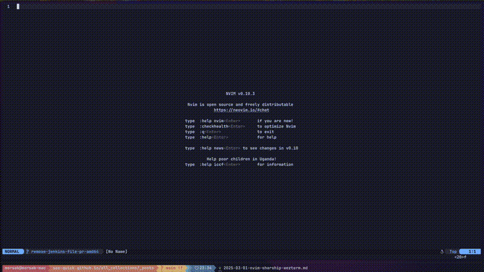
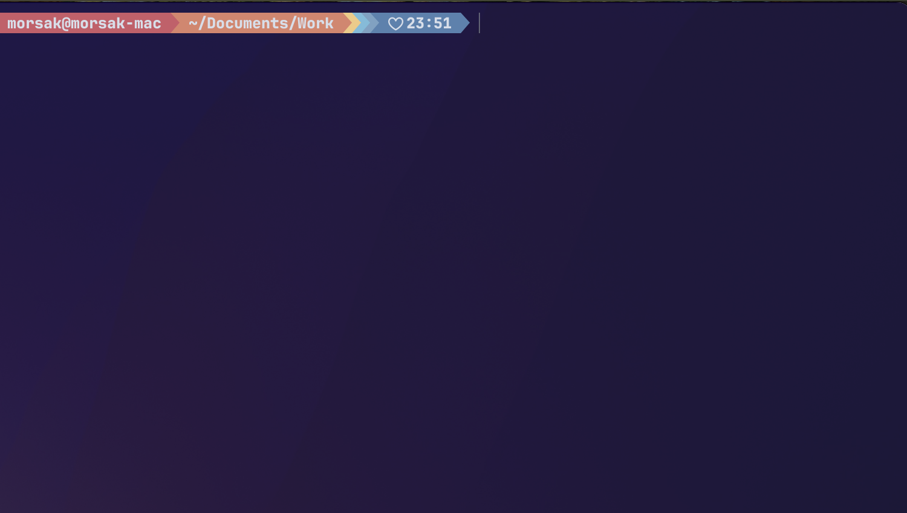

If you're looking to level up your development environment, combining Neovim (nvim) 📝, Starship 🚀, and WezTerm 💻 can give you a powerful, highly customizable, and visually appealing workflow. 
In this blog post, I’ll walk you through my setup, configurations, and how you can achieve a seamless coding experience. 🎯

---

## ✨ Neovim – The Ultimate Text Editor

Neovim is a modern take on Vim, offering better extensibility, performance, and built-in LSP (i.e., [Language Server Protocol](https://en.wikipedia.org/wiki/Language_Server_Protocol)) support 🔥.
Whether you’re debugging, navigating large codebases, or writing in multiple languages, Neovim’s plugin ecosystem makes it a powerhouse.

⚙️ My Neovim Config: [Github link](https://github.com/see-quick/dotfiles/tree/main/nvim)

🔥 Features:
- 🕵️‍♂️ Telescope – Fuzzy finder for quick file and text search.
- 🛠️ Built-in LSP – Get IDE-like autocompletion and inline diagnostics.
- 🐞 Debug Adapter Protocol (DAP) – Debug your code inside Neovim!
- 🎨 Theming – Beautiful colorschemes for a modern look.
- 🔹 Here’s an example of using Telescope for fuzzy finding:

🛠️ Here’s a glimpse of debugging in action!
Feels like magic, right? ✨😃

🔍 And with LSP fully integrated, you get real-time code insights, autocompletions, and inline error diagnostics—making development smoother than ever! 🚀

## 🚀 Starship – A Minimal, Blazing-Fast Shell Prompt

Your terminal prompt shouldn’t slow you down! Starship makes it simple yet powerful, displaying relevant information like Git status, runtime versions, and more – all while keeping things snappy.

⚙️ My Starship Config: [GitHub Link](https://github.com/see-quick/dotfiles/blob/main/starship.toml)

💡 Why I Love It:

- ⚡ Lightweight & Fast – No unnecessary slowdowns.
- 🎨 Fully Customizable – Theme it however you like!
- 🖥️ Works Across Shells – Bash, Zsh, Fish, and more.
- 🔹 Here’s how my Starship prompt looks in action:

📸 

## 💻 WezTerm – The Future of Terminal Emulators

WezTerm is a GPU-accelerated, modern terminal emulator that offers fantastic performance 🚀 and deep customization via Lua. If you’re tired of laggy terminals, this is for you!

⚙️ My WezTerm Config: [GitHub Link](https://github.com/see-quick/dotfiles/blob/main/wezterm/wezterm.lua)

🎯 Key Features:
- 🚀 GPU Acceleration – Makes rendering super smooth.
- 🔗 Multiplexing – Like tmux but integrated.
- 🎨 Powerline & Nerd Fonts Support – For a stunning terminal aesthetic.

## 🎬 Wrapping It Up

With Neovim, Starship, and WezTerm, you get a lightweight, powerful, and visually stunning setup that enhances productivity while keeping things efficient.

🔥 If you haven’t tried this trio yet, give it a shot and let me know how it goes! 🚀
💬 What does your dev setup look like? Drop a comment below!

