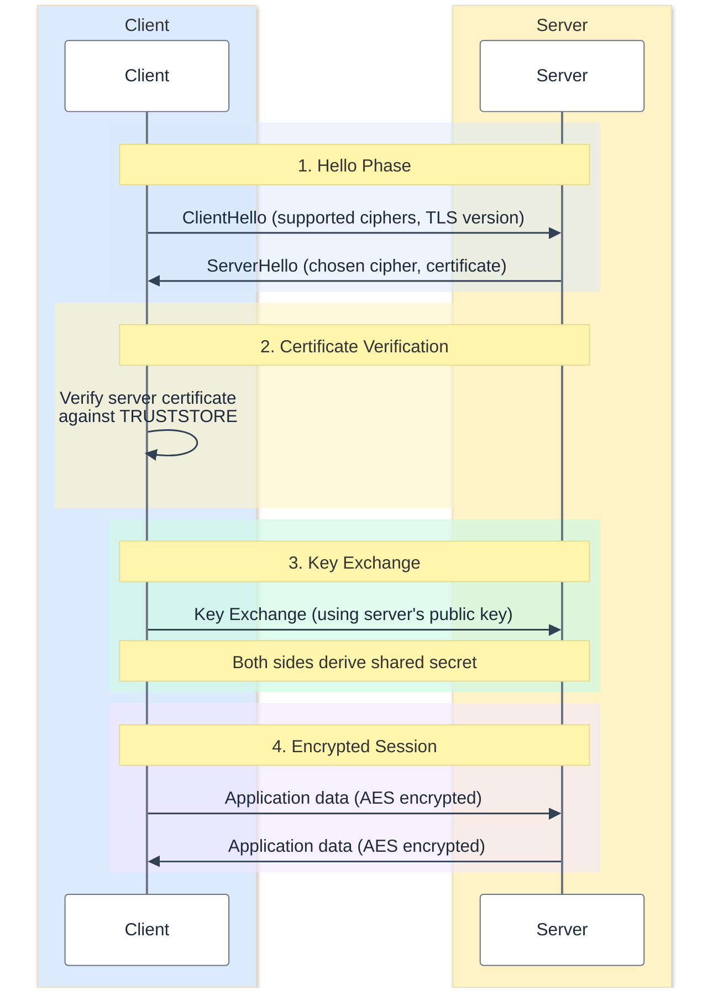

You have been there.
It is 11 PM, your Kafka cluster refuses to talk to your client, and the logs say `PKIX path building failed: sun.security.provider.certpath.SunCertPathBuilderException`.
You stare at the screen. 
You question your life choices. 
You Google "Java truststore keystore difference" for the 47th time in your career.

This post is the one you bookmark so you never have to do that again.

---

## What Even Is TLS?

**TLS** (Transport Layer Security) is the protocol that keeps the internet from being a giant postcard system.
Without it, every HTTP request you send is basically a love letter written on the outside of an envelope (i.e., anyone
in the middle can read it).

TLS gives you three things:

| Property              | What It Means                                                |
|-----------------------|--------------------------------------------------------------|
| **Confidentiality**   | Nobody can read the data in transit (encryption)             |
| **Integrity**         | Nobody can tamper with the data without detection            |
| **Authentication**    | You know you are talking to who you think you are talking to |

The magic ingredient? **Certificates** and **asymmetric cryptography**.

---

## The TLS Handshake (The "Getting to Know You" Phase)

Before any encrypted data flows, client and server perform a handshake.
Think of it like meeting someone at a party:

1. **Client Hello** — "Hey, I speak TLS 1.2 and 1.3, here are the cipher suites I know."
2. **Server Hello** — "Cool, let's go with TLS 1.3 and `TLS_AES_256_GCM_SHA384`. Here's my certificate."
3. **Certificate Verification** — The client checks: "Do I *trust* who signed this certificate?"
   This is where the **truststore** comes in.
4. **Key Exchange** — Both sides agree on a shared secret using asymmetric crypto (nobody listening can figure it out).
5. **Encrypted Session** — From here on, everything is encrypted with symmetric keys derived from that shared secret.

The asymmetric part (RSA, ECDHE) is only used during the handshake.
Once both sides have the shared secret, they switch to fast symmetric encryption (AES).
This is why TLS is not as slow as people think (i.e., the expensive crypto only happens once).



---

## Certificates 101

A certificate is a signed document that says:

> "I, **Certificate Authority (CA)**, certify that this public key belongs to `kafka.example.com`."

Certificates form a **chain of trust**:

```
Root CA (self-signed, lives in your truststore)
  └── Intermediate CA (signed by Root CA)
        └── Server Certificate (signed by Intermediate CA)
```

Your client does not need to know every server certificate in the world.
It just needs to trust the **Root CA** at the top. 
If the chain is valid all the way up, the server certificate is trusted. 
It is like a letter of recommendation (i.e., you do not know the applicant, but you trust the person who vouched for them, and you trust the person who vouched for *that* person).



---

## Keystore vs. Truststore — The One Slide That Explains Everything

Here is the fundamental difference, and I promise it is simpler than you think:

| Concept        | What It Stores                         | Who Uses It                         | Analogy                                      |
|----------------|----------------------------------------|-------------------------------------|----------------------------------------------|
| **Keystore**   | Your **own** private key + certificate | The entity proving its identity     | Your **passport** i.e., proves who *you* are |
| **Truststore** | **Other people's** CA certificates     | The entity verifying the other side | Your **list of trusted passport offices**    |

That's basically it. 
That's the whole thing.

- **Keystore** = "Here's my ID."
- **Truststore** = "Here are the IDs I accept."

When someone says *"add the certificate to the truststore"*, they mean:
"Tell your application to trust the CA that signed the server's certificate."

When someone says *"configure the keystore"*, they mean:
"Give your application its own identity so it can prove who it is (mutual TLS)."



---

## One-Way TLS vs. Mutual TLS (mTLS)

### One-Way TLS (The Default)

This is what happens when you visit `https://google.com`:

- The **server** presents its certificate.
- The **client** verifies it using its truststore.
- The server doesn't care who the client is.

**Who needs what:**

| Side   | Keystore? | Truststore? |
|--------|-----------|-------------|
| Server | Yes       | No          |
| Client | No        | Yes         |

### Mutual TLS (mTLS)

Both sides verify each other. 
Common in microservices, Kafka clusters, and anywhere you want "only authorized clients can connect."

- The **server** presents its certificate and client verifies it.
- The **client** presents its certificate and server verifies it.

**Who needs what:**

| Side   | Keystore? | Truststore? |
|--------|-----------|-------------|
| Server | Yes       | Yes         |
| Client | Yes       | Yes         |

Everyone has a passport, and everyone checks passports.
It is airport security, but for bytes.



---

## Java's TLS Toolchain: `keytool` and Friends

Java ships with `keytool`, a command-line utility for managing keystores and truststores.
Both are technically the same file format (JKS or PKCS12) i.e., the difference is purely about *what you put in them* and *how the JVM uses them*.

### Creating a Keystore (Your Passport Office)

Generate a key pair and self-signed certificate:

```bash
keytool -genkeypair \
  -alias server \
  -keyalg RSA \
  -keysize 2048 \
  -validity 365 \
  -keystore server.keystore.p12 \
  -storetype PKCS12 \
  -storepass changeit \
  -dname "CN=kafka.example.com,O=MyOrg,L=Prague,C=CZ"
```

What this does:
- Creates a new PKCS12 keystore file (`server.keystore.p12`)
- Generates a 2048-bit RSA key pair
- Creates a self-signed certificate valid for 365 days
- The `CN` (Common Name) should match your server's hostname

### Exporting the Certificate

To share your certificate with others (so they can add it to their truststore):

```bash
keytool -exportcert \
  -alias server \
  -keystore server.keystore.p12 \
  -storetype PKCS12 \
  -storepass changeit \
  -file server.crt \
  -rfc
```

The `-rfc` flag exports it in PEM format (i.e., the one that starts with `-----BEGIN CERTIFICATE-----`).
You know, the format that is actually readable.

### Creating a Truststore (Your "I Trust These People" List)

Import the server's certificate into a truststore:

```bash
keytool -importcert \
  -alias server \
  -file server.crt \
  -keystore client.truststore.p12 \
  -storetype PKCS12 \
  -storepass changeit \
  -noprompt
```

Now the client will trust any server presenting a certificate signed by (or identical to) `server.crt`.

### Inspecting What's Inside

Because you *will* forget what's in there:

```bash
# List all entries
keytool -list -keystore server.keystore.p12 -storetype PKCS12 -storepass changeit

# Show full certificate details
keytool -list -v -keystore server.keystore.p12 -storetype PKCS12 -storepass changeit
```

Pro tip: if the output says `PrivateKeyEntry`, it's a keystore entry (i.e., has a private key).
If it says `trustedCertEntry`, it's a truststore entry (i.e., just a certificate, no private key).

---

## The Full mTLS Setup: A Worked Example

Let's set up mutual TLS between a server and a client from scratch. 
Every command, no hand-waving.

### Step 1: Create a CA (Certificate Authority)

In production, you would use a real CA. 
For development and testing, we will be our own CA:

```bash
# Generate CA key pair and self-signed certificate
keytool -genkeypair \
  -alias ca \
  -keyalg RSA \
  -keysize 2048 \
  -validity 3650 \
  -keystore ca.p12 \
  -storetype PKCS12 \
  -storepass ca-secret \
  -dname "CN=MyCA,O=MyOrg,C=CZ" \
  -ext bc=ca:true

# Export CA certificate
keytool -exportcert \
  -alias ca \
  -keystore ca.p12 \
  -storetype PKCS12 \
  -storepass ca-secret \
  -file ca.crt \
  -rfc
```

### Step 2: Create the Server Keystore and Sign It

```bash
# Generate server key pair
keytool -genkeypair \
  -alias server \
  -keyalg RSA \
  -keysize 2048 \
  -validity 365 \
  -keystore server.keystore.p12 \
  -storetype PKCS12 \
  -storepass server-secret \
  -dname "CN=kafka.example.com,O=MyOrg,C=CZ"

# Create a Certificate Signing Request (CSR)
keytool -certreq \
  -alias server \
  -keystore server.keystore.p12 \
  -storetype PKCS12 \
  -storepass server-secret \
  -file server.csr

# Sign the CSR with our CA
keytool -gencert \
  -alias ca \
  -keystore ca.p12 \
  -storetype PKCS12 \
  -storepass ca-secret \
  -infile server.csr \
  -outfile server-signed.crt \
  -validity 365 \
  -rfc

# Import the CA cert into the server keystore (chain of trust)
keytool -importcert \
  -alias ca \
  -file ca.crt \
  -keystore server.keystore.p12 \
  -storetype PKCS12 \
  -storepass server-secret \
  -noprompt

# Import the signed certificate back into the server keystore
keytool -importcert \
  -alias server \
  -file server-signed.crt \
  -keystore server.keystore.p12 \
  -storetype PKCS12 \
  -storepass server-secret
```

### Step 3: Create the Client Keystore and Sign It

```bash
# Generate client key pair
keytool -genkeypair \
  -alias client \
  -keyalg RSA \
  -keysize 2048 \
  -validity 365 \
  -keystore client.keystore.p12 \
  -storetype PKCS12 \
  -storepass client-secret \
  -dname "CN=my-client,O=MyOrg,C=CZ"

# Create CSR
keytool -certreq \
  -alias client \
  -keystore client.keystore.p12 \
  -storetype PKCS12 \
  -storepass client-secret \
  -file client.csr

# Sign with CA
keytool -gencert \
  -alias ca \
  -keystore ca.p12 \
  -storetype PKCS12 \
  -storepass ca-secret \
  -infile client.csr \
  -outfile client-signed.crt \
  -validity 365 \
  -rfc

# Import CA cert + signed cert into client keystore
keytool -importcert \
  -alias ca \
  -file ca.crt \
  -keystore client.keystore.p12 \
  -storetype PKCS12 \
  -storepass client-secret \
  -noprompt

keytool -importcert \
  -alias client \
  -file client-signed.crt \
  -keystore client.keystore.p12 \
  -storetype PKCS12 \
  -storepass client-secret
```

### Step 4: Create Truststores

Both sides need to trust the CA:

```bash
# Server truststore (to verify clients)
keytool -importcert \
  -alias ca \
  -file ca.crt \
  -keystore server.truststore.p12 \
  -storetype PKCS12 \
  -storepass server-secret \
  -noprompt

# Client truststore (to verify server)
keytool -importcert \
  -alias ca \
  -file ca.crt \
  -keystore client.truststore.p12 \
  -storetype PKCS12 \
  -storepass client-secret \
  -noprompt
```

You now have:

| File                      | Contains                          | Used By |
|---------------------------|-----------------------------------|---------|
| `server.keystore.p12`     | Server private key + signed cert  | Server  |
| `server.truststore.p12`   | CA certificate                    | Server  |
| `client.keystore.p12`     | Client private key + signed cert  | Client  |
| `client.truststore.p12`   | CA certificate                    | Client  |

---

## Using It in Java

### Raw Java (SSLContext)

```java
import javax.net.ssl.*;
import java.security.*;
import java.io.*;

public class TlsConfig {

    public static SSLContext createSSLContext() throws Exception {
        // Load keystore (our identity)
        KeyStore keyStore = KeyStore.getInstance("PKCS12");
        try (InputStream ks = new FileInputStream("client.keystore.p12")) {
            keyStore.load(ks, "client-secret".toCharArray());
        }

        KeyManagerFactory kmf = KeyManagerFactory
            .getInstance(KeyManagerFactory.getDefaultAlgorithm());
        kmf.init(keyStore, "client-secret".toCharArray());

        // Load truststore (who we trust)
        KeyStore trustStore = KeyStore.getInstance("PKCS12");
        try (InputStream ts = new FileInputStream("client.truststore.p12")) {
            trustStore.load(ts, "client-secret".toCharArray());
        }

        TrustManagerFactory tmf = TrustManagerFactory
            .getInstance(TrustManagerFactory.getDefaultAlgorithm());
        tmf.init(trustStore);

        // Build SSLContext
        SSLContext sslContext = SSLContext.getInstance("TLS");
        sslContext.init(kmf.getKeyManagers(), tmf.getTrustManagers(), new SecureRandom());

        return sslContext;
    }
}
```

Not exactly poetry, but it gets the job done. 
The pattern is always the same:

1. Load the keystore (i.e., create `KeyManager`)
2. Load the truststore (.e, create `TrustManager`)
3. Combine them into an `SSLContext`

### JVM System Properties (The Quick Way)

Instead of writing code, you can pass system properties when starting any Java application:

```bash
java \
  -Djavax.net.ssl.keyStore=client.keystore.p12 \
  -Djavax.net.ssl.keyStorePassword=client-secret \
  -Djavax.net.ssl.keyStoreType=PKCS12 \
  -Djavax.net.ssl.trustStore=client.truststore.p12 \
  -Djavax.net.ssl.trustStorePassword=client-secret \
  -Djavax.net.ssl.trustStoreType=PKCS12 \
  -jar myapp.jar
```

This is great for quick testing. 
For production, configure it properly in your application's config.

### Apache Kafka Example

Since this is where most people encounter TLS pain (speaking from experience), here's how to configure a Kafka producer/consumer with mTLS:

```java
Properties props = new Properties();

// Connection
props.put("bootstrap.servers", "kafka.example.com:9093");

// TLS
props.put("security.protocol", "SSL");
props.put("ssl.keystore.location", "/path/to/client.keystore.p12");
props.put("ssl.keystore.password", "client-secret");
props.put("ssl.keystore.type", "PKCS12");
props.put("ssl.truststore.location", "/path/to/client.truststore.p12");
props.put("ssl.truststore.password", "client-secret");
props.put("ssl.truststore.type", "PKCS12");
props.put("ssl.key.password", "client-secret");

KafkaProducer<String, String> producer = new KafkaProducer<>(props);
```

And on the **broker side** (`server.properties`):

```properties
listeners=SSL://kafka.example.com:9093
ssl.keystore.location=/path/to/server.keystore.p12
ssl.keystore.password=server-secret
ssl.keystore.type=PKCS12
ssl.truststore.location=/path/to/server.truststore.p12
ssl.truststore.password=server-secret
ssl.truststore.type=PKCS12
ssl.client.auth=required
ssl.endpoint.identification.algorithm=
```

Setting `ssl.client.auth=required` enables mTLS (i.e., the broker will reject any client that does not present a valid certificate.

---

## JKS vs. PKCS12 — Which Format?

You'll see two keystore formats in the wild:

| Format     | Extension      | Notes                                                             |
|------------|----------------|-------------------------------------------------------------------|
| **JKS**    | `.jks`         | Java-proprietary, older, still works                              |
| **PKCS12** | `.p12`, `.pfx` | Industry standard, works everywhere, **recommended since Java 9** |

Since Java 9, `PKCS12` is the default keystore type. 
Use it. 
If you have old JKS files, convert them:

```bash
keytool -importkeystore \
  -srckeystore old.jks \
  -srcstoretype JKS \
  -destkeystore new.p12 \
  -deststoretype PKCS12
```

JKS is like a fax machine; it still works, everyone has used one, but there is no good reason to start with one in 2026.

---

## PEM, DER, PKCS12 — The Format Zoo

Certificates come in different formats, and it is really confusing. 
Here is the cheat sheet:

| Format     | Encoding | File Extensions        | What It Looks Like                             |
|------------|----------|------------------------|------------------------------------------------|
| **PEM**    | Base64   | `.pem`, `.crt`, `.key` | `-----BEGIN CERTIFICATE-----` (human-readable) |
| **DER**    | Binary   | `.der`, `.cer`         | Binary blob (not human-readable)               |
| **PKCS12** | Binary   | `.p12`, `.pfx`         | Bundle of private key + cert + chain           |

**Converting between them** (using `openssl`):

```bash
# PEM to DER
openssl x509 -in cert.pem -outform DER -out cert.der

# DER to PEM
openssl x509 -in cert.der -inform DER -outform PEM -out cert.pem

# PEM key + cert to PKCS12
openssl pkcs12 -export \
  -in cert.pem \
  -inkey key.pem \
  -out bundle.p12 \
  -name "my-alias"

# PKCS12 to PEM (extract everything)
openssl pkcs12 -in bundle.p12 -out everything.pem -nodes
```

---

## Debugging TLS Issues

When things go wrong (and they will), these are your best friends.

### 1. Enable Java TLS Debug Logging

```bash
java -Djavax.net.debug=ssl:handshake -jar myapp.jar
```

This will print *everything* about the TLS handshake. 
It is verbose, but it tells you exactly where things fail. 
Common things to look for:

- `"no suitable certificate found"` i.e., your keystore is misconfigured
- `"PKIX path building failed"` i.e., your truststore does not contain the right CA
- `"certificate_unknown"` i.e., the server does not trust your client certificate

### 2. Test with OpenSSL

Check what certificate a server presents:

```bash
openssl s_client -connect kafka.example.com:9093 -showcerts
```

This shows the full certificate chain. 
Compare it against what is in your truststore.

### 3. Verify a Certificate Chain

```bash
# Check if a certificate is signed by a CA
openssl verify -CAfile ca.crt server-signed.crt
```

If this says `OK`, your chain is valid. 
If not, you have a chain problem.

### 4. Check Certificate Expiry

```bash
# From a file
openssl x509 -in server.crt -noout -dates

# From a live server
echo | openssl s_client -connect kafka.example.com:9093 2>/dev/null \
  | openssl x509 -noout -dates
```

Nothing ruins your Monday like an expired certificate. 
Ask me how I know... :D

### 5. Check What is in a PKCS12 File

```bash
openssl pkcs12 -in server.keystore.p12 -info -nokeys
```



---

## The Most Common Mistakes (A Hall of Shame)

After years of watching people (myself included) struggle with TLS, here are the greatest hits:

### 1. Putting the CA Certificate in the Keystore Instead of the Truststore

The keystore is for **your** identity. 
The truststore is for **who you trust**.
If you put the CA cert in the keystore, Java won't use it for trust verification.
You'll get `PKIX path building failed` and wonder why.

### 2. Forgetting to Import the CA Chain into the Keystore

When you import your signed certificate back into the keystore, the CA certificate must already be there. 
Otherwise, `keytool` can't build the chain, and your server will send an incomplete chain to clients.

### 3. Wrong `CN` / Missing SANs

If your certificate says `CN=localhost` but you're connecting to `kafka.example.com`,
hostname verification will fail. 
In modern TLS, **Subject Alternative Names (SANs)** are preferred over CN:

```bash
keytool -genkeypair \
  -alias server \
  -keyalg RSA \
  -keysize 2048 \
  -keystore server.keystore.p12 \
  -storetype PKCS12 \
  -storepass changeit \
  -dname "CN=kafka.example.com,O=MyOrg,C=CZ" \
  -ext "SAN=dns:kafka.example.com,dns:localhost,ip:127.0.0.1"
```

### 4. Expired Certificates

Certificates expire. 
Set up monitoring.
Your future self will thank you.
It happened, multiple times that I saw very popular services facing such problem, and it's a bit of shame for them :). 

---

## Quick Reference Card

Here's every command you'll need, collected in one place:

```bash
# === GENERATE ===
# Generate key pair + self-signed cert
keytool -genkeypair -alias NAME -keyalg RSA -keysize 2048 \
  -keystore KEYSTORE.p12 -storetype PKCS12 -storepass PASS \
  -validity 365 -dname "CN=hostname"

# === EXPORT / IMPORT ===
# Export certificate
keytool -exportcert -alias NAME -keystore KEYSTORE.p12 \
  -storetype PKCS12 -storepass PASS -file cert.crt -rfc

# Import certificate into truststore
keytool -importcert -alias NAME -file cert.crt \
  -keystore TRUSTSTORE.p12 -storetype PKCS12 -storepass PASS -noprompt

# === SIGN ===
# Create CSR
keytool -certreq -alias NAME -keystore KEYSTORE.p12 \
  -storetype PKCS12 -storepass PASS -file request.csr

# Sign CSR with CA
keytool -gencert -alias ca -keystore ca.p12 -storetype PKCS12 \
  -storepass PASS -infile request.csr -outfile signed.crt -rfc

# === INSPECT ===
# List entries
keytool -list -keystore KEYSTORE.p12 -storetype PKCS12 -storepass PASS

# Verbose listing
keytool -list -v -keystore KEYSTORE.p12 -storetype PKCS12 -storepass PASS

# === CONVERT ===
# JKS to PKCS12
keytool -importkeystore -srckeystore old.jks -srcstoretype JKS \
  -destkeystore new.p12 -deststoretype PKCS12

# === DEBUG ===
# Java TLS debug
java -Djavax.net.debug=ssl:handshake -jar app.jar

# Check server certificate
openssl s_client -connect host:port -showcerts

# Check certificate dates
openssl x509 -in cert.crt -noout -dates
```

---



---

Now go forth and encrypt all the things.
And next time someone asks you the difference between a keystore and a truststore, just remember: passport vs. list of trusted passport offices.
You'll never forget again (hopefully :D).

Stay curious, and ... until next time!
